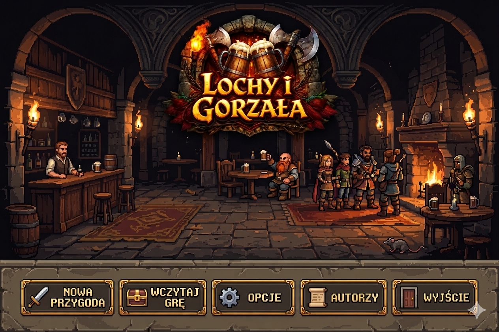

# LOCHY & GORZAŁA (LiG) — Wersja Produkcyjna

**Lochy & Gorzała** to klimatyczny 2D Dungeon Crawler z elementami RPG, osadzony w brudnym świecie słowiańskich mitów. Gracz wciela się w Gniewka — zgorzkniałego łowcę potworów, który zamiast many używa alkoholu (bimber, okowita), a jego siła rośnie wraz z poziomem toksyczności organizmu.

## 🎮 O Grze
*   **Gatunek:** Dungeon Crawler / RPG Turowe.
*   **Bohater:** Gniewko, używający bimbru do wzmacniania swoich ataków.
*   **Cel:** Przejście 5 pięter lochu i pokonanie finałowego bossa — Deliriusa.
*   **Mechanika:** Unikalny system PA (Punktów Akcji) oraz zarządzanie poziomem toksyczności (Buffy vs DoT).

## 🛠️ Stos Technologiczny
*   **Silnik:** Unity 6000.4.0f1
*   **Renderowanie:** URP 2D (Compatibility Mode)
*   **Język:** C# (.NET Standard 2.1)
*   **Input:** New Input System
*   **Architektura:** Separacja logiki (Pure C#) od warstwy wizualnej (MonoBehaviour / View).

---

## 👥 Zespół i Podział Prac

Projekt jest podzielony na gałęzie tematyczne (`feature branches`). Każdy członek zespołu pracuje na swoim obszarze:

| Osoba | Rola | Branch | Obszar odpowiedzialności |
|---|---|---|---|
| **Ellianel** | Lead Dev / PM | `feature/core-logic` | Fundamenty, Managerowie, Eventy, Core Logic |
| **Jarek** | Logic Developer | `feature/combat-ai` | System walki, logiki przeciwników (8 klas), Combat Engine |
| **R3QU_111** | Logic Developer | `feature/world-generation` | Generacja lochów (BSP), mechanika przejść między piętrami |
| **Bengaloo** | UI/UX Designer | `feature/ui-inventory` | Interfejs użytkownika, ekwipunek, system przedmiotów, Resources |
| **Blaine_pl** | QA / Developer | `feature/player-mechanics` | Sterowanie, system NPC, interakcje, testy stabilności |

---

## 🏗️ Struktura Projektu
*   `Assets/Scripts/Core` — Czysta logika gry (bez zależności od Unity).
*   `Assets/Scripts/Combat` — Silnik walki i akcje.
*   `Assets/Scripts/Dungeon` — Algorytmy generowania poziomów.
*   `Assets/Scripts/UI` — Kontrolery widoku i interfejsu.
*   `Assets/Context` — Pełna dokumentacja projektowa (decyzje, TODO, kontekst).

---

## 🚀 Instrukcja dla Deweloperów
1.  Pobierz najnowszą wersję z gałęzi `main`.
2.  Stwórz swój branch (np. `git checkout -b feature/twoja-nazwa`).
3.  Pracuj w wyznaczonych folderach zgodnie z planem.
4.  **ZASADA:** Zawsze kopiuj/przesuwaj pliki razem z ich plikami `.meta`.
5.  Po zakończeniu prac wystaw Pull Request do `main`.

---
*Projekt realizowany w ramach współpracy zespołowej. Wszelkie prawa zastrzeżone.*
